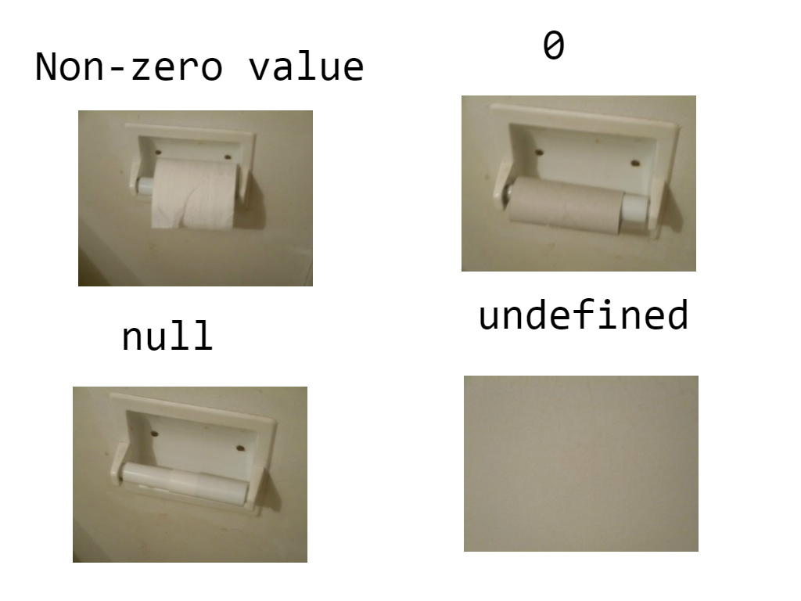

# 모던 자바스크립트 입문

## 1. 자바스크립트의 개요

### 인터프리터 언어의 비애

프로그래밍 언어는 다양한 방식으로 구분할 수 있다. 그중 실행 방식에 따라서 컴파일 언어와 인터프리터 언어, 추가로 하이브리드 언어로 구분할 수 있다. 컴파일 언어의 대표적인 예시가 C++이고, 인터프리터 언어의 경우 Python, JavaScript, 하이브리드 언어의 경우 Java가 여기에 해당된다. 책에서는 두 가지밖에 없다고 했지만 엄연히 하이브리드 언어라는 것도 있다.

컴파일 언어의 경우 프로그래머가 작성한 언어를 그대로 기계어로 바꿔버린다. 이를 컴파일 과정이라고 한다. 그리고 런타임에서는 그리고 그 기계어를 실행하기만 하면 된다.

인터프리트 방식에서 빠지지 않고 등장하는 개념이 바이트코드다. 기본적으로 코드를 한 줄씩 읽으면서 중간단계의 바이트코드로 변환한다. 바이트코드의 경우 어셈블리 코드와 비슷한 형태를 가지고 있다. 이 바이트코드를 실행하는 것이 인터프리터다. 인터프리터는 가상 머신 위에서 이 바이트코드를 운영체제에 맞는 기계어로 변환해서 실행한다. 

이걸 누가 하냐? 자바스크립트 엔진이 한다. 대표적인 엔진이 크롬에서 쓰는 V8 엔진이다. 자바에서는 JRE가 이 역할을 했다면 JS에는 자바스크립트 엔진을 탑재한 브라우저가 이 역할을 한다. 그래서 자바 프로그램은 JRE만 있으면 서로 다른 OS에서도 실행될 수 있으며, 자바스크립트는 브라우저만 있으면 JS로 코드를 짤 수 있다.

순수 인터프리트 방식은 알다시피 느리다. 그래서 V8과 같은 자바스크립트 엔진은 JIT 컴파일러를 도입했다. JIT 컴파일러가 뭐냐. 실행 시간에 컴파일, 즉 코드를 기계어로 변환하는 것이다. 인터프리터가 한 줄씩 바이트코드로 바꿀 시간에 JIT 컴파일러가 그냥 '그 부분은 바로 기계어로 바꾸는 게 좋을듯 ㅋㅋ' 하면서 최적화시키는 것이다. 어떤 부분을 최적화하면 좋을까? 그야 자주 쓰는 내장 함수나 중복해서 등장하는 코드들이다.

번외로 자바도 JIT 컴파일러를 사용하는데, 여기서는 '자주 호출되는 메서드를 먼저 컴파일하고, 자주 등장하는 메서드를 더 높은 최적화 레벨'로 설정하는 방식으로 최적화한다. 사실 자바는 모든 게 다 클래스고 객체고 메서드라서 그냥 '메서드 호출 횟수' 기준으로 최적화 기준을 정해버리면 된다.

자바도 인터프리트 방식의 단점을 해결하기 위해 JIT 컴파일러를 도입했고 자바스크립트 역시 이를 해결하기 위해 JIT 컴파일러를 도입했다. 정도로만 알아두자. 하나 재밌는 점은 JS V8 엔진과 OpenJVM의 모듈 네이밍이다. 아까 전 우리는 인터프리터와 JIT 컴파일러에 대해서 알아봤다. V8의 경우 인터프리터를 `Ignition`이라고 부르고, 이를 최적화하는 JIT 컴파일러를 `TurboFan`이라고 한다. 뜨거운 인터프리터를 (최적화 코드로) 식히는 `TurboFan`... 이라는 꽤 유쾌한 알레고리라고 추측해본다.

우연의 일치인지는 모르겠지만, `OpenJ9` JVM의 JIT 컴파일러에는 네 가지 최적화 레벨이 있다. `cold`, `warm`, `veryHot`, `scorching`이다. 컴파일러쟁이들이 JIT 컴파일러에 가지는 이미지가 꽤 비슷하다는 생각이 들지 않는가? 아무튼 그렇다.

### 동적 타이핑 언어의 비애

JS와 Python이 간결한 이유는 동적 타이핑 언어이기 때문이다. 코드 상에 타입을 지정해주지 않더라도 런타임에 인터프리터가 타입을 알아서 추론해준다. 코드 작성하기는 편하지만 결국 큰 규모의 프로젝트에서는 부적합하고 프로그램 신뢰도가 떡락하기 때문에 정적 타이핑을 지원하는 TypeScript를 사용한다. Python의 경우 Type Hint 같은 걸 쓴다고.

### 렉시컬 스코핑과 실행 컨텍스트와 클로저

좀 무서워보이는 용어 세 개가 나왔는데 일단 앞의 둘을 알고 있어야 클로저를 이해하는 데 도움이 된다.

- 렉시컬 스코핑 : 호출 시점이 아니라 선언 위치에 따라 참조 대상이 확정되는 것
- 실행 컨텍스트 : 메서드가 실행되기 위해 필요한 정보들이 들어있는 환경.
    - 변수객체 (인자, 변수)
    - 스코프 체인 (현재 스코프에서 찾지 못할 경우 타고 올라갈 순서, 렉시컬 스코핑에 의해 선언 위치에 따라 결정됨)
    - this 대상 (기본적으로 window)
- 클로저 : 함수와 함수가 선언된 렉시컬 스코프의 조합. 실제로 호출한 함수는 실행 스택에 의해서는 없어졌지만, 클로저가 가지고 있는 실행 컨텍스트에는 스코프 체인이 있는데, 이 스코프 체인은 없어진 호출 함수의 변수객체를 포함하기 때문에 참조할 수 있음. 즉 클로저를 사용하면 (클로저를 호출하고 반환하는) 실행 스택과 무관하게 해당 클로저의 렉시컬 스코프에 존재하는 스코프 체인을 사용하여 현재 실행 스택에서는 접근할 수 비공개 변수에 접근할 수 있게 된다. 

왜 이런 번거롭고 어려운 방식을 채택했냐. 태초의 JS에는 클래스 개념이 없었기 떄문이다. 그러니 접근 제어자도 없고 비공개 변수도 번거롭게 모듈 패턴이니 클로저니 하는 것들로 구현하는 것이다.

## 2. 프로그램의 작성법과 실행법

기초적인 내용은 생략한다. 적당히 중요한 부분만 정리하도록 하겠다.

`HTML`, `CSS` 스타일을 제어하지 않는 JS 프로그램은 script 요소를 body에 배치한다. 반면 제어하는 경우에는 head 자식 요소로 배치한다. 이는 JS 프로그램과 HTML 문서를 분리하기 위함이다.

`Node.js`란? Chrome V8 JS 엔진으로 빌드된 JavaScript Runtime 이라고 한다. 이게 무슨 말이냐. 이 JS 엔진이라는 것은 원래 브라우저에 탑재된다. 크롬 콘솔에서 JS 코딩이 가능한 이유도 이 때문이다. 핵심은 런타임이다. 크롬이라는 브라우저 바깥에서도 JS 프로그램을 돌리기 위해 존재한다. 그럼 뭐가 가능해지냐? 브라우저에서 HTML, CSS 스타일만 만지작 거릴 게 아니라, JS 기반으로 쓰여진 서버 애플리케이션을 만들 수 있다. 진짜 뭔가 좀 언어스러워지는 것이다. 아무튼 노드를 실행하면 브라우저에서 했던 것처럼 콘솔에다가 즉시 이런저런 코드를 찍어볼 수 있다 (이걸 `REPL`이라고 한다. 같은 인터프리터 언어인 파이썬도 같은 걸 가지고 있다)

토큰은 문법적으로 의미를 갖는 최소 단위이다. 프언에서 배우는 내용이다. JS 엔진은 코드를 다음 구조로 변환한다: 코드 - (토크나이저) - 토큰 - (파서) - AST - (인터프리터) - 바이트코드. 코드를 뭐 `if`나 `return`이나 `1`, `2` ... 같이 의미있는 덩어리로 쪼개는 걸 토크나이징, 파서에 넣어서 이게 문법적으로 올바른 규칙인지 판단한다. 규칙은 트리 구조로 되어있어서 이걸 돌리고 나면 결과는 트리 구조로 나온다. 그래서 AST(추상 구문 트리)가 그 결과다.

문장(statement)는 세미클론으로 종결된다. 복합문/블록은 중괄호로 감싸진다. 한 문장 후 개행하면 세미콜론을 자동으로 추가하여 해석해준다.

## 3. 변수와 값

### 변수 선언

JS에는 변수이름에 대한 선언자로 `var`을 쓴다. ECMAScript 6부터는 `let`, `const` 같은 선언자도 추가되었다. 뭐 중복 선언이 되고... 호이스팅이 어쩌구... 하는 이야기를 들었던 것 같은데 뒤에서 따로 다룰 예정이다. 변수는 상자다. 엄밀하게는 물건을 가리키는 화살표지만 이건 객체지향 쪽 이야기니까 그냥 상자에 붙은 이름표 비유를 계속 써먹자. 아무튼 상자에 문자열이 담길 수도 있고 숫자가 담길 수도 있지만 그와 관계없이 일단 상자가 만들어져야 한다. 이걸 선언이라고 한다. 

참고로 아래에서 선언하더라도 참조 에러가 발생하지 않는다. 이는 호이스팅 때문이다. 호이스팅은 변수 선언이 프로그램 최상단으로 끌어올려지는 것'처럼 동작하는 것'을 말한다. '마치 그런 것처럼 (실제로도 맞긴 하지만)' 동작하는 거고 실제로는 더 복잡하다는 거다.

그럼 어떻게? 그건 JS가 실행 컨텍스트의 렉시컬 환경을 생성하는 과정, 즉 생성 단계에서 선언문만 환경 레코드에 먼저 기록해기 때문이다. 

그럼 왜? 왜 컨텍스트인가? 왜 렉시컬인가? 그 부분에 대해서는 '[자바스크립트는 왜 프로토타입을 선택했는가](https://medium.com/@limsungmook/%EC%9E%90%EB%B0%94%EC%8A%A4%ED%81%AC%EB%A6%BD%ED%8A%B8%EB%8A%94-%EC%99%9C-%ED%94%84%EB%A1%9C%ED%86%A0%ED%83%80%EC%9E%85%EC%9D%84-%EC%84%A0%ED%83%9D%ED%96%88%EC%9D%84%EA%B9%8C-997f985adb42)' 아티클을 읽어보는 것을 추천한다. 간단하게 정리하자면 프로토타입 기반 언어인 자바스크립트는 맥락(context)를 중요시하고, JS에서는 이 맥락을 렉시컬 스코핑- 기준으로부터 가깝고 멂에 따라 정했다는 것이다.

### 원시 타입

JS의 데이터 타입에는 원시 타입과 객체 타입이 있다. 참고로 자바는 객체 타입 대신 참조 타입이라고 한다. 다음은 원시 타입 유형이다.

- 숫자
- 문자열
    - 작은따옴표가 문장 내부에 포함되었다면 큰따옴표로 표기한다.
    - JS를 HTML 요소에 넣을 때 HTML 코드에는 큰따옴표, JS 코드의 문자열에는 작은따옴표로 구별하는 방식으로 사용한다.
- 논리값
- 특수값 (`undefined`, `null`)
    - 
- 심벌
    - 다른 어떤 것과도 다름이 보장되는 '값'
    - 심벌에 대한 문자열 키를 설정할 수 있다. 그러면 `Symbol.for(key)`로 키에 해당하는 동일한 싱글턴 심벌을 반환받을 수 있다. `keyFor(symbol)`로 심벌에 해당하는 키를 반환받을 수 있다.

### 템플릿 리터럴

백틱으로 감싼 문자열로, 이스케이프 문자 없이 개행문자만으로도 줄바꿈 할 수 있다. 템플릿 리터럴 앞에 `String.raw`를 붙이면 이스케이스 문자를 그대로 추력할 수 있다. 문자열 리터럴로는 `\\n`이 된다. 

### 보간 표현식

문자열 안의 표현식을 평가하여 값으로 넣을 수 있다.

## 객체와 배열, 함수의 기초

### 객체

JS의 객체는 별게 없다. 키-값 쌍, 즉 프로퍼티를 가진 딕셔너리를 객체라고 한다.

객체는 객체 리터럴과 생성자 함수를 사용하여 만들 수 있다. 객체 리터럴의 경우 우리가 아는 JSON의 그 객체처럼 만들면 된다. 중괄호로 감싸진 그거. 키는 그냥 적어도 되고 문자열로 적어도 된다. 객체의 키로 값에 접근할 수 있다. dotted 방식과 object[key]와 같이 접근 가능하다.

존재하지 않는 프로퍼티를 읽으면 `undefined` 이다. 하지만 존재하지 않는 프로퍼티에 값을 할당하면 프로퍼티 추가다. `delete object.key`와 같이 해당 키의 프로퍼티를 삭제 가능하다. `"key" in object`로 프로퍼티가 존재하는지 확인할 수 있다. 

추가로, 객체의 프로퍼티 값이 함수면 메서드다. 

### 함수 

함수 선언에도 호이스팅이 적용된다.

원시 값은 값에 의한 호출, 객체 값은 참조에 의한 호출이다.

JS의 경우 위치 매개변수 결합(파라미터 순서)과 이름 매개변수 결합(파라미터 이름, 순서 무시) 둘 다 지원한다.

함수 내에서도 호이스팅은 발생한다. 단, 그 함수의 맨 위로 끌어올려지는 것이다. 그래서 그냥 무작정 맨 위가 아니다. 엄밀하게 말하면 '실행 컨텍스트 생성 시 **렉시컬 스코프의** 선언이 끌어올려지는 것'이다.

`var`로 선언하지 않은 상태에서 대입 시 전역변수로 선언된다.

`let`은 블록 유효 범위를 갖는 지역변수다. 해당 블록 내에서 유효하고 외부에서 참조할 수 없게 만들기 위함이다.
