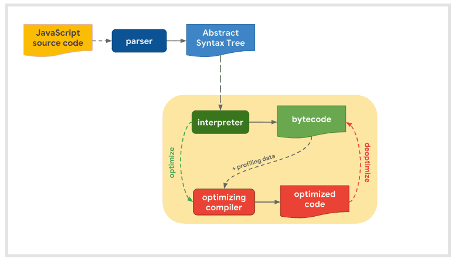
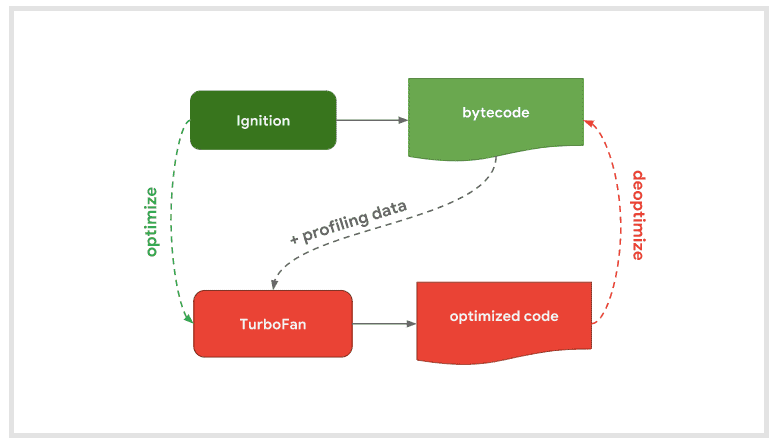

# 모던 자바스크립트 입문

> disclaimer : 해당 책을 읽고 남기는 글입니다. 실제 내용과는 차이가 있을 수 있습니다.

## 1. 자바스크립트의 개요

### 인터프리터 언어의 비애

프로그래밍 언어는 다양한 방식으로 구분할 수 있다. 그중 실행 방식에 따라서 컴파일 언어와 인터프리터 언어, 추가로 하이브리드 언어로 구분할 수 있다. 컴파일 언어의 대표적인 예시가 C++이고, 인터프리터 언어의 경우 Python, JavaScript, 하이브리드 언어의 경우 Java가 여기에 해당된다.

컴파일 언어의 경우 프로그래머가 작성한 언어를 그대로 기계어로 바꿔버린다. 이를 컴파일 과정이라고 한다. 그리고 런타임에서는 그리고 그 기계어를 실행하기만 하면 된다.

인터프리트 방식에서 빠지지 않고 등장하는 개념이 바이트코드다. 기본적으로 코드를 한 줄씩 읽으면서 중간단계의 바이트코드로 변환한다. 바이트코드의 경우 어셈블리 코드와 비슷한 형태를 가지고 있다. 이 바이트코드를 실행하는 것이 인터프리터다. 인터프리터는 가상 머신 위에서 이 바이트코드를 운영체제에 맞는 기계어로 변환해서 실행한다. 

이걸 누가 하냐? 자바스크립트 엔진이 한다. 대표적인 엔진이 크롬에서 쓰는 V8 엔진이다. 자바에서는 JRE가 이 역할을 했다면 JS에는 자바스크립트 엔진을 탑재한 브라우저가 이 역할을 한다. 그래서 자바 프로그램은 JRE만 있으면 서로 다른 OS에서도 실행될 수 있으며, 자바스크립트는 브라우저만 있으면 JS로 코드를 짤 수 있다.

순수 인터프리트 방식은 알다시피 느리다. 그래서 V8과 같은 자바스크립트 엔진은 JIT 컴파일러를 도입했다. JIT 컴파일러가 뭐냐. 실행 시간에 컴파일, 즉 코드를 기계어로 변환하는 것이다. 인터프리터가 한 줄씩 바이트코드로 바꿀 시간에 JIT 컴파일러가 그냥 '그 부분은 바로 기계어로 바꾸는 게 좋을듯 ㅋㅋ' 하면서 최적화시키는 것이다. 어떤 부분을 최적화하면 좋을까? 그야 자주 쓰는 내장 함수나 중복해서 등장하는 코드들이다.

번외로 자바도 JIT 컴파일러를 사용하는데, 여기서는 '자주 호출되는 메서드를 먼저 컴파일하고, 자주 등장하는 메서드를 더 높은 최적화 레벨'로 설정하는 방식으로 최적화한다. 사실 자바는 모든 게 다 클래스고 객체고 메서드라서 그냥 '메서드 호출 횟수' 기준으로 최적화 기준을 정해버리면 된다.

자바도 인터프리트 방식의 단점을 해결하기 위해 JIT 컴파일러를 도입했고 자바스크립트 역시 이를 해결하기 위해 JIT 컴파일러를 도입했다. 정도로만 알아두자. 하나 재밌는 점은 JS V8 엔진과 OpenJVM의 모듈 네이밍이다. 아까 전 우리는 인터프리터와 JIT 컴파일러에 대해서 알아봤다. V8의 경우 인터프리터를 `Ignition`이라고 부르고, 이를 최적화하는 JIT 컴파일러를 `TurboFan`이라고 한다. 뜨거운 인터프리터를 (최적화 코드로) 식히는 `TurboFan`... 이라는 꽤 유쾌한 알레고리라고 추측해본다.

우연의 일치인지는 모르겠지만, `OpenJ9` JVM의 JIT 컴파일러에는 네 가지 최적화 레벨이 있다. `cold`, `warm`, `veryHot`, `scorching`이다. 컴파일러쟁이들이 JIT 컴파일러에 가지는 이미지가 꽤 비슷하다는 생각이 들지 않는가? 아무튼 그렇다.

### 동적 타이핑 언어의 비애

JS와 Python이 간결한 이유는 동적 타이핑 언어이기 때문이다. 코드 상에 타입을 지정해주지 않더라도 런타임에 인터프리터가 타입을 알아서 추론해준다. 코드 작성하기는 편하지만 결국 큰 규모의 프로젝트에서는 부적합하고 프로그램 신뢰도가 떡락하기 때문에 정적 타이핑을 지원하는 TypeScript를 사용한다. Python의 경우 Type Hint 같은 걸 쓴다고.

단적으로 말해서 동적 타이핑 언어로는 회사에서 밥 벌어먹기 어렵다는 이야기다.

### 렉시컬 스코핑과 실행 컨텍스트와 클로저

좀 무서워보이는 용어 세 개가 나왔는데 일단 앞의 둘을 알고 있어야 클로저를 이해하는 데 도움이 된다.

- 렉시컬 스코핑 : 호출 시점이 아니라 선언 위치에 따라 참조 대상이 확정되는 것
- 실행 컨텍스트 : 메서드가 실행되기 위해 필요한 정보들이 들어있는 환경.
    - 변수객체 (인자, 변수)
    - 스코프 체인 (현재 스코프에서 찾지 못할 경우 타고 올라갈 순서, 렉시컬 스코핑에 의해 선언 위치에 따라 결정됨)
    - this 대상 (기본적으로 window)